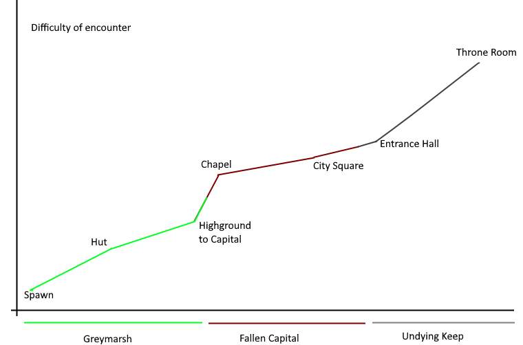

# 3.3 Checking Development Tests

A complete set of tests should be run to assess the final solution.

These tests will be the main tests from each of the cycles. Some smaller tests (e.g. retests) will be left out and the tests in cycle 0 will not be done because that experimental cycle did not affect the final product. Additionally, some tests will be modified as they were originally testing non-final assets (e.g. the dev cube in 1.1 no longer exists).

## Tests

I have all of my evidence for checking my development tests in the following video. In the top right corner it will show which tests are being done and below I will detail information about what each of the tests are. Some tests have further evidence in their description in the page below.


2 and a bit mins long of all the tests unedited except for text to help discern which tests are which


| 1.1 | Run code | See menu, no errors in console | Pass |
| --- | -------- | ------------------------------ | ---- |

<figure><figcaption></figcaption></figure>

| 2.3 | Move mouse in game           | Camera moves around                             | Pass |
| --- | ---------------------------- | ----------------------------------------------- | ---- |
| 2.4 | Move mouse and press W/A/S/D | Player moves around in direction of the camera. | Pass |

Both tests passed without fuss, simply needed me to input keys and mouse movement. Keyboard movements are frame perfect responsive and the player moves exactly how as input with high control.

| 3.2 | Walk into a wall | Player cannot move into the wall | Pass |
| --- | ---------------- | -------------------------------- | ---- |

All walls work well but I also wanted to test out the corners as they could act oddly. Fortunately, they all acted as expected.

| 4.1 | Load game scene      | All 3D models correctly load             | Pass |
| --- | -------------------- | ---------------------------------------- | ---- |
| 4.2 | Walk into a 3D Model | Player cannot move into it's tube hitbox | Pass |

Loading the 3d models into the game has never been an issue, moving them has but this will be addressed in 7.1, 7.3 & 7.4. The cylindrical hitbox of the models provides no issues and prevents the player walking through enemies and trees.

| 5.1 | Press space                       | Player moves upwards, then gradually returns to ground                       | Pass |
| --- | --------------------------------- | ---------------------------------------------------------------------------- | ---- |
| 5.2 | Jump to a higher elevation        | As above, with a lower velocity before the player touches the ground         | Pass |
| 5.3 | Jump to a lower elevation         | As above, with a higher velocity before the player touches the ground        | Pass |
| 5.4 | Press left shift for a short time | Player rolls in direction of camera quickly, but for a finite amount of time | Pass |
| 5.5 | Hold left shift                   | Player can move as normal, but faster                                        | Pass |

All 'complicated' controls have been usually bug free too. The jump feels really nice now that I've done the maths and all the state checking to determine if an action can be performed works well. There is a slight lag behind pressing left shift and rolling because the game has to work out if the press was to run or to roll, which takes a few frame to figure out.

| 6.1 | Attack so that the sword model passes through the enemy             | Target takes damage and is stunned | Pass |
| --- | ------------------------------------------------------------------- | ---------------------------------- | ---- |
| 6.2 | Attack so the sword model misses the enemy, by both range and angle | No effects                         | Pass |
| 6.7 | Attempt to attack while not walking or standing still               | Does not happen                    | Pass |

During this second test, I was repeatedly pressing left click for the whole duration

| 7.1 | Move         | The sword model should follow by the player's side | Pass |
| --- | ------------ | -------------------------------------------------- | ---- |
| 7.3 | Light attack | Sword swings in an arc                             | Pass |
| 7.4 | Heavy attack | Sword thrusts forwards, slightly to the right      | Pass |

| 8.1 | Get close and in line of sight to an enemy, then break line of sight or move too far away | Enemy becomes aggressive and starts moving towards the player, stops moving when player cannot be seen anymore | Pass |
| --- | ----------------------------------------------------------------------------------------- | -------------------------------------------------------------------------------------------------------------- | ---- |
| 8.4 | Move side to side while an enemy is aggressive                                            | Enemy always faces the player                                                                                  | Pass |
| 8.6 | Let enemy approach                                                                        | The enemy approaches and then selects an attack to perform once in range                                       | Pass |
| 8.7 | Reduce enemy's health to 0                                                                | Enemy disappears, stops moving and cannot be harmed. Shows "King Slain" on screen if a boss enemy              | Pass |

| 9.1 | Press e very close to a respawn point, repeat when further away | Saves when the player is close, does nothing when further away                     | Pass |
| --- | --------------------------------------------------------------- | ---------------------------------------------------------------------------------- | ---- |
| 9.4 | Save, kill an enemy, then die to another                        | Respawn by the standard, slain enemy respawns and other injured enemies are healed | Pass |

As with 6.7, I was repeatedly pressing e for the duration of this whole test (not very well as I managed to perfectly time missing it the first time)

| 10.2 | Click start game button | Animation plays, main game starts to load            | Pass |
| ---- | ----------------------- | ---------------------------------------------------- | ---- |
| 10.3 | Wait at menu screen     | Title text glows from white to red and back          | Pass |
| 10.4 | Get hurt                | Health bar decreases, background stays the same size | Pass |

| 11.2 | Pull Greymarsh lever, then the Capital lever | Gate to Capital chapel opens, then the gate to the keep opens | Pass |
| ---- | -------------------------------------------- | ------------------------------------------------------------- | ---- |
| 11.5 | Try to move through gate                     | Blocks player with invisible wall                             | Pass |

