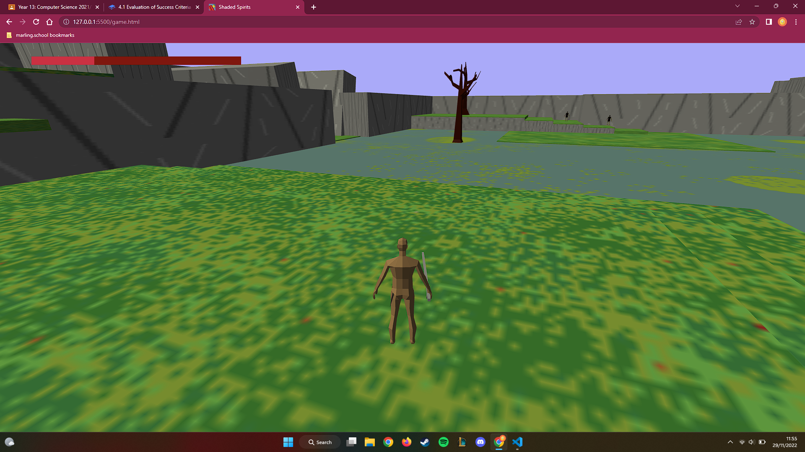

# 4.2 Evaluation of Usability Features

## Effective

| Feature No. | Description                                     | Success/Fail                                         |
| ----------- | ----------------------------------------------- | ---------------------------------------------------- |
| 1           | The player knows where to go                    | <mark style="background-color:green;">Success</mark> |
| 2           | The enemies telegraph their attacks well        | <mark style="background-color:green;">Success</mark> |
| 3           | The UI is easily readable                       | <mark style="background-color:green;">Success</mark> |
| 4           | The player can navigate easily around the world | <mark style="background-color:green;">Success</mark> |

### Feature 1

The way forwards was often hinted by a change in the world's visual design and areas that were not to be accessed yet were sealed off with a gate. Where to go was ultimately for the the player to discover but only one part opened at a time and parts of the world frequently give hints on where to go next e.g. the exit from the fallen capital directly faces the gate to the undying keep as it opens.

### Feature 2

All enemies attacks have telegraphing to indicate when and in what direction they will attack. Enemies with multiple attacks have different telegraphs per attack so they player can tell what attack to expect if they have seen that telegraph before. The grey knight enemies do fail in this aspect however as both of their attacks have the same telegraph animation with the only difference being the time the telegraph takes, which is not a perfectly reliable way to predict an attack. The final boss' sweep and stab also suffer from this issue but it is less severe as those attacks are very similar in manner and can be predicted by knowing his attack patterns.

### Feature 3

The UI for most of gameplay is a single red bar whose length is proportional to the player's remaining health. It also has a background of a darker colour that does not change length, allowing the player to see how much health they have lost.&#x20;

### Feature 4

The distinct layout and visual identity of each of the areas makes it easy for the player to know where they are. The swamp is green, blue and very open, the capital is grey, brown and has a towering buildings and the keep is grey and very enclosed. From the starting swamp the player is able to see all of the future areas they will visit so they know from the start where to go.

## Efficient

| Feature No. | Description                                             | Success/Fail                                         |
| ----------- | ------------------------------------------------------- | ---------------------------------------------------- |
| 1           | Menus are easy to navigate                              | <mark style="background-color:green;">Success</mark> |
| 2           | Loading times are short                                 | <mark style="background-color:green;">Success</mark> |
| 3           | The player can move with control and speed in the world | <mark style="background-color:green;">Success</mark> |

### Feature 1

The menu is a single button which is clearly labelled with 'Start Game' which is very simple for players to navigate. The animation of the button gives the player visual feedback that they pressed the button.

### Feature 2

The loading time is about four and a half seconds which is longer than I would have expected for this game but only happens once per play session and it gives visual feedback on the progress as the player can see the environment loading in front of them, showing them that the game is loading and has not froze.

### Feature 3

The range of controls allows the player to move quickly to traverse large distances and move slowly in order to make more precise movements. They can also get momentary bursts of speed by rolling and can make shortcuts by jumping. This range means that the player can use their array of controls to get around the world quickly and precisely.

## Engaging

| Feature No. | Description                             | Success/Fail                                         |
| ----------- | --------------------------------------- | ---------------------------------------------------- |
| 1           | The player enjoys playing the game      | <mark style="background-color:green;">Success</mark> |
| 2           | The player feels challenged             | <mark style="background-color:green;">Success</mark> |
| 3           | The boss challenges the player's skills | <mark style="background-color:green;">Success</mark> |

### Feature 1

The game starts relatively easy, only the weakest enemy and they are easy to avoid, but gets harder with the enemies being harder to avoid fighting and their strength increasing.&#x20;

<figure><figcaption>
Approximate difficulty vs progression through game
</figcaption></figure>

The approximate graph of difficulty vs game progression above (based on player difficulty in each section from observation) shows that the game has a positive steady increase of difficulty, with two spikes in order to break up the flow and make the player feel challenged. Increasing difficulty over time lets players enjoy the game by keeping the game neither frustrating nor boring which is enjoyable for the players.

### Feature 2

The game does not give the player any method of healing during fights meaning that they have to make sure they get hit as little as possible and have to play with less margin for mistakes. This helps to make the game challenging. The player and the enemies using the same attacking system also helps to make the game challenging as they player has to be aware that they can be stunned just as much as enemies can so they have to time their attacks so that they will not get hit in the process.

### Feature 3

The boss has much more health than any other enemy in the game so the fight last much longer than any other, this means the player has more chances to make mistakes so they have to play much better. Additionally, the boss has a wide variety of attacks that each require a separate strategy to avoid, requiring fast decision making from the player.

## Error Tolerant

| Feature No. | Description                                                               | Success/Fail                                         |
| ----------- | ------------------------------------------------------------------------- | ---------------------------------------------------- |
| 1           | The game is relatively bug free, any bugs do not majorly affect gameplay. | <mark style="background-color:red;">Failure</mark>   |
| 2           | The player is able to skip fights or content without the game breaking    | <mark style="background-color:green;">Success</mark> |

### Feature 1

The game contains a wide variety of bugs ranging from walls that suck enemies/players into them to freezing the player on the spot by attacking at the right time. Many of these bugs will render the game unplayable (without a refresh) or significantly alter it in some way.

### Feature 2

The progression of the game is tied solely to activatable levers and lets the player ignore any fight they want or use any route they wish without unexpected behaviour occurring.

## Easy To Learn

| Feature No. | Description                                                    | Success/Fail                                         |
| ----------- | -------------------------------------------------------------- | ---------------------------------------------------- |
| 1           | The controls are intuitive                                     | <mark style="background-color:green;">Success</mark> |
| 2           | The number of different controls is not too large or too small | <mark style="background-color:green;">Success</mark> |

### Feature 1

The function of each of the controls is immediately obvious once they are used and only do one action each, meaning that actions and controls have a one to one relationship which makes it easy for the brain to learn.

### Feature 2

The player is able to choose between a faster attack or higher damage attack and has movement options that allow them to choose between normal speed, a faster speed or an even faster burst of speed that only lasts for a short time. They can also jump in order to scale certain obstacles quickly or avoid attacks by moving over them. This amount is enough for the player to have all the options they need but not too many to remember.
