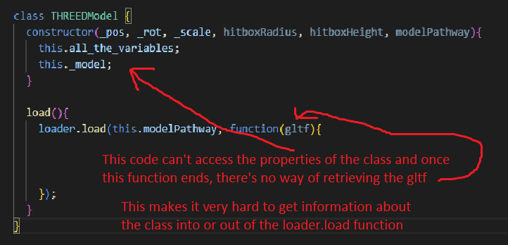

# 2.2.7 Cycle 7 - Combat II (Animations and refactoring)

### Design

Having animations will allow the player to follow what attacks are being performed visually instead of just assuming that they are happening. Having the player also be able to perform a heavier attack with a differently shaped hitbox makes it more risky but have a much larger payoff. Having weapon model accurate hitboxes lets the player make a reasonable guess about where they will get hit.

## Objectives

* [x] Add stab attacks that move out in a straight line instead of sweeping in front
* [x] Add some basic animation to attacking
  * [x] The animations must sync with the hitboxes and be near perfect
* [x] Re-write attacking functionality to let it work against the player
* [x] Have the player become a full on combatant instead of just acting like one

### Key Variables

| Variable Name   | Use                                                                               |
| --------------- | --------------------------------------------------------------------------------- |
| playerWeapon    | Links to the gltf scene of the weapon model so that it can be moved in animations |
| attack.type     | Tells the attack what hitbox pattern to draw and how to animate the sword.        |
| playerCombatant | The combatant that links to the player, replaced the old playerCombatant object   |

## Development

### Outcome

In order to give the player more choices in combat, I am now adding the 'stab' move. The stab will move in a straight line in front of the player and be offset by an amount. My current attacks system will make it very easy to add more attacks of complicated or simple shapes. The stab will cover less total area and take longer to perform but have a longer reach and will do more damage and stun enemies for longer. In order for attacks to know which function to use when generating their hitbox, I gave them a string determining it.

```
class attack{
    ...
    attack(a, b, c){
      switch (this.type){
        case "sweep":
          this.sweep(a, b);
          break;
        case "stab":
          this.stab(a, b, c);
          break;
        case "chop":
          this.stab(a, b, c);
          break;
      }
    }
    ...
    stab(user, progression, offset){
      let startVector = new THREE.Vector3(); // create vector
      user.getWorldDirection(startVector); // set it to new direction
      const yAngle = user.rotation.y;
      this._Points = [];
      this.hitboxPoints.forEach(point => {
        this._Points.push(new THREE.Vector3(user.position.x + offset.x + startVector.x * (point + progression), user.position.y + startVector.y * (point + progression), user.position.z + offset.z + startVector.z * (point + progression)));
      })
      this.showWeapon(yAngle);
      this.checkCollision();
  }
  ...
}
```

While doing this I also decided that the checking collision would be its own separate function so that once a hitbox was generated, I could just call the function instead of re-writing all of the code again.

```
class attack{
  ...
  checkCollision(){
    combatants.forEach(combatant => {
      this._Points.forEach(_point => {
        if (MATHS.distance(_point, combatant.model._pos) < this.hitboxDRadius && !MATHS.arrayContains(this.hasHit, combatant.name)){
          this.hasHit.push(combatant.name);
          combatant.hurt(this.damage);
          console.log(combatant.name + " was injured! new health: " + combatant.hp.toString());
        }
      })
    })
    this._Points.forEach(point => {
      this._Points.pop(point);
    })
  }
  ...
}
```

The problem with attacks so far is that the player has no visual indicator for what is currently happening. To fix this I added a model of a sword which hovers by the player's side when not in use but swipes or stabs when an attack is being used. The animations are created in real time by moving the model on top of all of the hitboxes and, hopefully, covering them perfectly.

```
class attack {
  ...
  showWeapon(direction){
    this.model.position.set(this._Points[0].x, this._Points[0].y, this._Points[0].z);
    this.model.rotation.set(0, direction, 0);
  }

  prepareWeapon(a, b, user){
    switch (this.type){
      case "sweep":
        this.unsheath(a, b, user);
        break;
      case "stab":
        break;
      case "chop":
        break;
    }
  }

  unsheath(percentAnim, offset, user){
    this.model.position.set(user.mesh.position.x - (0.75 * offset.x), user.mesh.position.y - 0.35 + (percentAnim * 0.35), user.mesh.position.z - (offset.z * 0.75));
    this.model.rotation.set(user.mesh.rotation.x, user.mesh.rotation.y, user.mesh.rotation.z);
  }
}
```


I made this video before I added stab and idle animations for sword, you'll see those two further down this page however


I then changed up lots of the code that replaced the object named 'playerCombatant' with an actual combatant. This would allow enemies to hit the player (once given AI). There wasn't any major code re-writes aside from replacing a few variables and nothing with this particularly stood out or changed functionality as the intended result was for there to be no change.

I also took the time to give the player a better body that a red rectangle. I downloaded a low-poly human model from Sketchfab to use and moved the sword's idle spot to fit snugly in his hand.

 (2) (1).png>)



### Challenges

This was a particularly tricky cycle for me as it involved a lot of code re-writing. My biggest issue was with a small part of setting up the player's combatant class. As it required a model, I decided now would also be a good time to make it so that THREEDmodel classes contained a variable pointing to their own model so that it could be animated in real time. This proved challenging because of some bizarre quirks involving scope within the GLTFLoader.load function.



My potentially overly complicated solution was to have the model save itself into an array and then create a constant in the load() function that was within the scope of the loader.load() function. Then, in the loader.load(), the model would send it's model to a function which would 'bounce it back' to the model, who could then modify this.\_model appropriately. The constant would point to the model's own position in the array, acting as a sender recipient.

```javascript
class THREEDModel {
  constructor(_pos, _rot, _scale, hitboxRadius, hitboxHeight, modelPathway){
    ...
    this._model = playerWeapon;
  }

  load(){
    ...

    collidableModels.push(this);
    const CMindex = collidableModels.length - 1;
    
    loader.load(this.modelPathway, function(gltf){
      ...
      bounceBackGLTFScene(gltf.scene, CMindex);
    });
  }

  set_Model(modul){
    this._model = modul;
  }
}

function bounceBackGLTFScene(scene, recipient){
  console.log("bouncing " + recipient.toString());
  collidableModels[recipient].set_Model(scene);
}
```

## Testing

| Test | Instructions         | What I expect                                                                  | What actually happens                                                                               |
| ---- | -------------------- | ------------------------------------------------------------------------------ | --------------------------------------------------------------------------------------------------- |
| 1    | move around          | player model moves with player and rotates to match direction                  | As expected, albeit with a slight delay - feels like he is being pulled on a lead instead of moving |
| 2    | move around (repeat) | " " + in sync with player hitbox                                               | As Expected                                                                                         |
| 3    | light attack         | sword model swings in an arc in front of the player                            | As Expected                                                                                         |
| 4    | heavy attack         | Sword stabs out slightly to the side of player, hitbox is accurate to the stab | As Expected                                                                                         |
